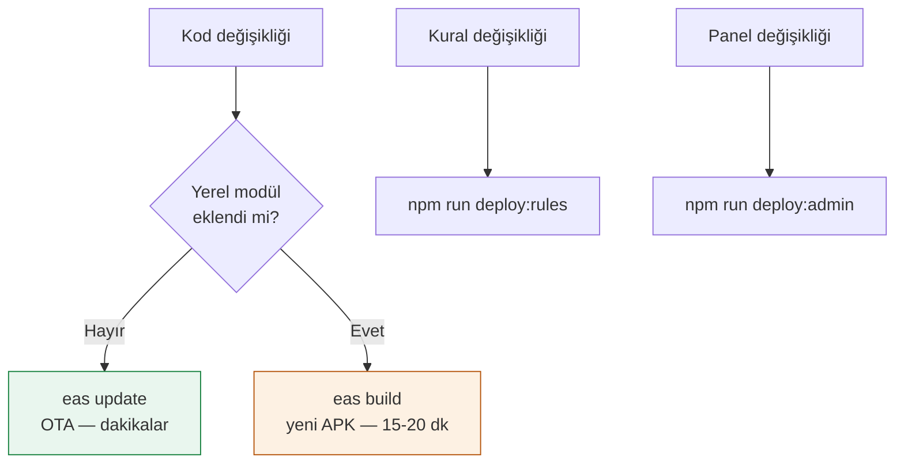

# Dağıtım

## Üç ayrı yol



## OTA güncellemesi

```bash
npx eas-cli update --branch preview --environment preview \
  --message "Ne değişti"
```

- **Kanal:** `preview` (kullanıcıların dinlediği tek kanal)
- **Runtime:** 1.0.0 — `appVersion` politikasından geliyor
- Kullanıcılar **ikinci açılışta** alır (birincide indirir)

> [!danger] Yerel modül eklediysen OTA yetmez
> Yeni bir yerel modül (ör. `expo-crypto`) eklenirse OTA paketi mevcut
> ikili dosyada olmayan bir modülü çağırır ve uygulama **çöker**.
> Ayrıntı: [[ADR 002 expo-crypto kaldırıldı]]

## Yeni APK

```bash
npx eas-cli build --platform android --profile preview
```

`preview` profili: `buildType: apk`, `channel: preview`,
`environment: preview`.

### Derleme öncesi kontrol listesi

- [ ] Bağımlılıklar mevcut ikili dosyayla uyumlu mu (OTA planlanıyorsa)
- [ ] EAS ortam değişkenleri tanımlı mı (`eas env:list --environment preview`)
- [ ] `eas.json` commit'lendi mi (EAS git'ten okur)

### Derleme sonrası doğrulama

APK indirilip açılarak kontrol edilebilir:

```bash
unzip -qo yeni.apk -d apk
# manifest'te güncelleme yapılandırması
python3 -c "print(open('apk/AndroidManifest.xml','rb').read().decode('utf-16-le','ignore'))" | grep EXPO_UPDATE_URL
# paket içinde yapılandırma ve yeni arayüz dizeleri
python3 -c "b=open('apk/assets/index.android.bundle','rb').read(); print('Prim kalemleri'.encode() in b)"
```

> [!tip] Hermes dize kodlaması
> ASCII dizeler 1 bayt, Türkçe karakter içerenler **UTF-16** saklanır.
> Arama yaparken iki kodlamayı da denemek gerekir.

## Firestore kuralları

```bash
npm run deploy:rules
```

## Yönetim paneli

```bash
npm run deploy:admin   # → https://maas-primtakip.web.app
```

İlgili: [[Sorun Giderme OTA gelmiyor]] · [[Teknoloji Yığını]]
