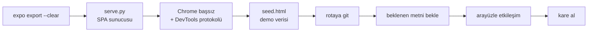

# Ekran Görüntüsü Üretimi

Bu kasadaki ve README'deki tüm görüntüler **otomatik üretildi** — tasarım
maketi değil, gerçek uygulamanın çıktısı.

```bash
node docs/demo/capture.mjs              # derler ve yakalar
node docs/demo/capture.mjs --skip-build # mevcut dist/ ile
```

## Nasıl çalışıyor



## Neden `--screenshot` bayrağı değil

Chrome'un `--screenshot` bayrağı, uygulama paketi çalışmadan **önce** kareyi
yakalıyor — 3,6 MB'lık paket gerçek zamanda ayrıştığı için sanal zaman bütçesi
işe yaramıyor. CDP ile beklenen metin DOM'a gelene kadar beklenip sonra kare
alınıyor.

Aynı oturumda konsol istisnaları da toplanıyor; bir ekran hata verirse
`✗` ile birlikte hata mesajı yazdırılıyor. React Compiler hatası bu yolla
bulundu → [[ADR 004 React Compiler null erişimi]]

## Demo verisi

`seed.html` localStorage'a 6 aylık maaş kaydı ve 7 harcama yazıp istenen
rotaya yönlendirir. Web'de AsyncStorage doğrudan localStorage'a yazdığı için
bu mümkün.

## Metro önbelleği tuzağı

> [!bug] `--clear` neden zorunlu
> Metro önbelleği bayat kaldığında `process.env.EXPO_PUBLIC_*` değerleri
> pakete **`undefined`** olarak gömülüyor ve uygulama açılışta
> "Firebase yapılandırması eksik" hatasıyla çöküyor. Ekran görüntüsü
> üretimi bir kez bu yüzden 0/13 sonuç verdi.
> Ayrıntı: [[Sorun Giderme Metro önbelleği]]

İlgili: [[Dağıtım]] · [[Yönlendirme]]
