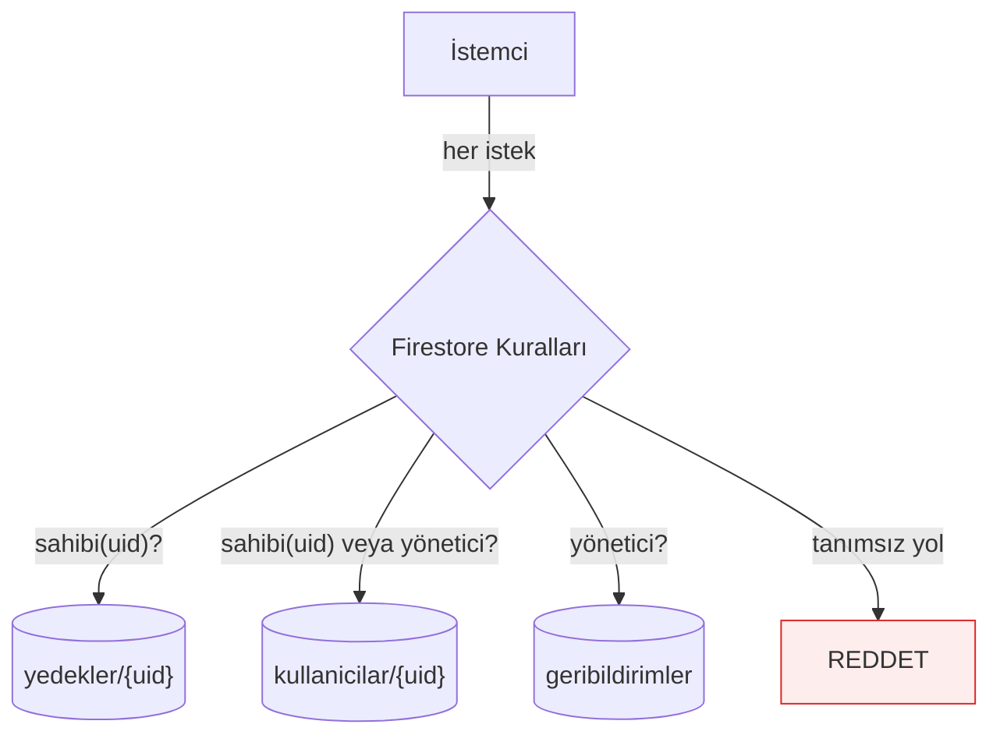

# Güvenlik Genel Bakış

Sunucu kodu olmadığı için `firestore.rules` **tek savunma hattı**.

## Durum

| Alan | Durum |
|---|---|
| Firestore kuralları | ✅ Canlıda, sahiplik doğrulanıyor |
| Yönetim paneli XSS | ✅ Kapatıldı |
| Yedek erişimi | ✅ Yalnızca sahibi |
| Kimlik modeli | ✅ Anonim → kalıcı yükseltme |
| E-posta servisi | ✅ Kaldırıldı ([[ADR 003 EmailJS yerine mailto]]) |
| Yönetici doğrulaması | ⚠️ `email_verified` kontrolü yorumda |

## Tehdit modeli

Uygulamayı indiren herkes:

- Anonim oturum açabilir
- Firestore'a istemci SDK'sı ile istek atabilir
- Uygulama paketini açıp Firebase yapılandırmasını okuyabilir

Bu **normal ve beklenen**. Firebase istemci yapılandırması gizli değildir;
koruma tamamen kurallardan gelir.

Kritik soru şu: *"Anonim bir saldırgan başkasının maaş verisini görebilir mi?"*
Cevap artık **hayır**. Eskiden **evet**ti → [[Kapatılan Açıklar]]

## Katmanlar

İlgili: [[Firestore Kuralları]] · [[Kimlik Doğrulama]] · [[Kapatılan Açıklar]]
