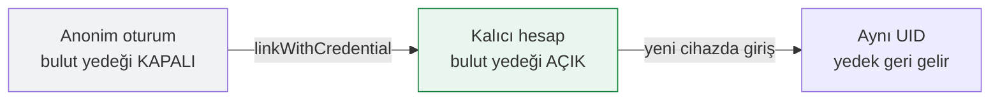

# Kimlik Doğrulama

İki katmanlı model.



## Anonim oturum

Uygulama açılışta `signInAnonymously()` çağırır. Bu modda:

- Uygulama tamamen yerel çalışır
- Firestore'a yalnızca geri bildirim yazılabilir
- Bulut yedeği **kapalı** (`yedeklemeAcikMi()` false döner)

Neden yedek kapalı: anonim UID cihaza özeldir; uygulama silinirse geri
getirilemez. Böyle bir yedek yanıltıcı olurdu.

## Kalıcı hesaba yükseltme

Kullanıcı şifre belirlediğinde:

```js
if (mevcut?.isAnonymous) {
  const kimlik = EmailAuthProvider.credential(eposta, sifre);
  return await linkWithCredential(mevcut, kimlik);  // UID KORUNUR
}
```

`linkWithCredential` kritik: yeni hesap oluşturmak yerine mevcut anonim
hesabı yükseltir, dolayısıyla o ana kadar yazılmış veriler kaybolmaz.

## Kalıcılık

```js
initializeAuth(app, {
  persistence: getReactNativePersistence(AsyncStorage)
})
```

> [!danger] `getAuth()` yeterli değil
> Firebase JS SDK'sı React Native'de varsayılan olarak **belleği** kullanır.
> `getAuth()` ile açılan oturum uygulama kapanınca kaybolur ve her açılışta
> yeni bir anonim UID üretilir — UID ile anahtarlanan yedeğe bir daha
> erişilemez. İlk sürümdeki hata buydu.

`getReactNativePersistence` yalnızca react-native derlemesinde bulunduğu için
koşullu `require` ile alınır; web'de `getAuth()` kullanılır.

## Hata çevirisi

`hatayiCevir()` Firebase hata kodlarını Türkçe mesajlara çevirir:

| Kod | Mesaj |
|---|---|
| `auth/email-already-in-use` | Bu e-posta zaten kullanımda. Giriş yapmayı deneyin. |
| `auth/invalid-credential` | E-posta veya şifre hatalı. |
| `auth/too-many-requests` | Çok fazla deneme yapıldı. |
| `auth/operation-not-allowed` | E-posta/şifre girişi Firebase projesinde etkin değil. |

İlgili: [[Firestore Kuralları]] · [[Kayıt Ekranı]] · [[Profil Ekranı]]
