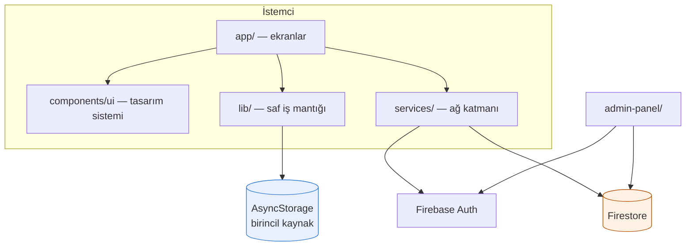

# Mimari Genel Bakış

Sunucu tarafı kod **yok**. Uygulama doğrudan Firestore ile konuşur; yetkilendirme
tamamen [[Firestore Kuralları|güvenlik kurallarında]].



## Katman kuralı

| Katman | Ne yapar | Neyi bilmez |
|---|---|---|
| `lib/` | Saf fonksiyonlar: hesap, biçimleme, depolama | Firebase'i, React'i |
| `services/` | Ağ: kimlik, yedek, kullanıcı, geri bildirim | Arayüzü |
| `components/ui/` | Görsel bileşenler | İş mantığını |
| `app/` | Ekranlar — yukarıdakileri birleştirir | — |

Bu ayrım sayesinde [[Prim Hesaplama Kuralı|prim hesabı]] ağ bağlantısı olmadan
test edilebilir ve dört ayrı ekrandan aynı fonksiyon çağrılır.

## Dosya yapısı

```
app/                    rotalar (dosya = ekran)
  _layout.tsx           göç, oturum, tema sağlayıcı
  (tabs)/               index · expenses · explore · history
  kayit · profil · feedback
components/ui/          20 bileşenlik tasarım sistemi
theme/                  jetonlar + ThemeProvider
lib/                    prim · storage · format · ids
services/               firebase · auth · backup · users · feedback
admin-panel/            tek dosya web paneli
docs/                   teknik doküman + ekran görüntüsü üretici
firestore.rules         tek yetkilendirme noktası
```

İlgili: [[Katmanlar]] · [[Veri Akışı]] · [[Durum Yönetimi]]
