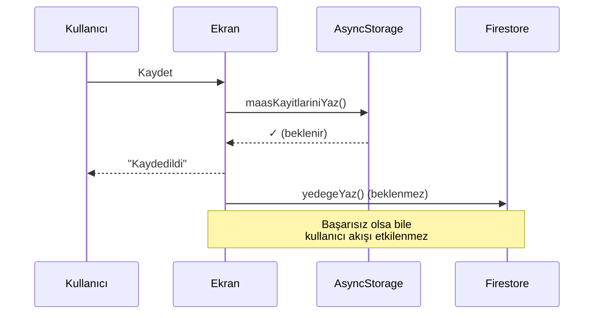
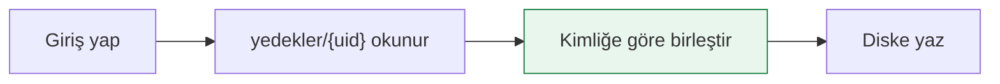
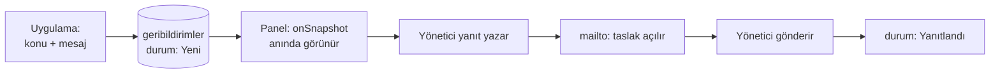

# Veri Akışı

## Yazma yolu



Sıra bilinçli: **önce disk, sonra bulut**. Bulut yazması `await` edilmez.

## Okuma yolu

Ekran odağa geldiğinde diskten okunur, normalleştirilir ve takvim sırasına
sokulur. Ayrıntı: [[Durum Yönetimi]]

## Geri yükleme (cihaz değiştirme)



Birleştirme `listeleriBirlestir()` ile kimliğe göre yapılır — yerel ve
buluttaki kayıtların hiçbiri kaybolmaz:

```js
const harita = new Map();
bulut.forEach((k) => k?.id && harita.set(k.id, k));
yerel.forEach((k) => k?.id && harita.set(k.id, k));  // yerel kazanır
return Array.from(harita.values());
```

Bu yüzden kimliklerin çakışmaması kritik → [[ADR 002 expo-crypto kaldırıldı]]

## Geri bildirim döngüsü



Son adımda panel **onay ister** — e-postanın gerçekten gönderildiğini
bilemeyeceği için varsayım yapmaz.
Ayrıntı: [[ADR 003 EmailJS yerine mailto]]

İlgili: [[Veri Modeli]] · [[Yönetim Paneli]]
