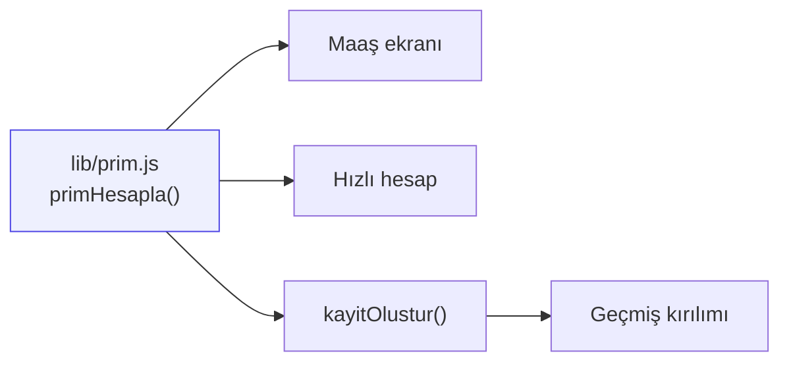

# Prim Hesaplama Kuralı

Tüm uygulamanın etrafında döndüğü iş kuralı. **Tek kaynak:** `lib/prim.js`.

## Formül

```
birim(kalem) = anaMaaş × ORAN[kalem]
tutar(kalem) = birim(kalem) × adet(kalem)
toplam       = anaMaaş + Σ tutar(kalem)
```

## Oranlar

| Kalem | Oran | Alan adları |
|---|---|---|
| Kurulum | %2,5 | `kurulumAdet` / `kurulumPara` |
| Hafta içi nöbet | %2,5 | `haftaIciAdet` / `haftaIciPara` |
| Hafta sonu nöbet | %3,5 | `haftaSonuAdet` / `haftaSonuPara` |
| Araç nöbeti | %3,5 | `aracAdet` / `aracPara` |

## Örnek

42.000 TL maaş, 12 kurulum, 6 hafta içi, 4 hafta sonu, 3 araç:

| Kalem | Birim | Adet | Tutar |
|---|---|---|---|
| Ana maaş | — | — | 42.000 |
| Kurulum | 1.050 | 12 | 12.600 |
| Hafta içi | 1.050 | 6 | 6.300 |
| Hafta sonu | 1.470 | 4 | 5.880 |
| Araç | 1.470 | 3 | 4.410 |
| **Toplam** | | | **71.190** |

## Kimler kullanıyor



Oranı değiştirmek için yalnızca `PRIM_ORANLARI` güncellenir.

> [!todo] Açık iş
> Oranlar şu an kodda sabit. Şirket politikası değişirse yeni sürüm
> yayınlamak gerekiyor. Firestore'dan okunan uzaktan yapılandırma bunu
> çözerdi.

## Yardımcılar

| Fonksiyon | Ne yapar |
|---|---|
| `primHesapla(maas, adetler)` | Hesabın tamamı |
| `kayitOlustur({id, ay, maas, adetler})` | Diske yazılacak kayıt biçimi |
| `kayittanAdetler(kayit)` | Düzenleme formunu geri doldurmak için |

İlgili: [[Maaş Ekranı]] · [[Hızlı Hesap Ekranı]] · [[Veri Modeli]]
