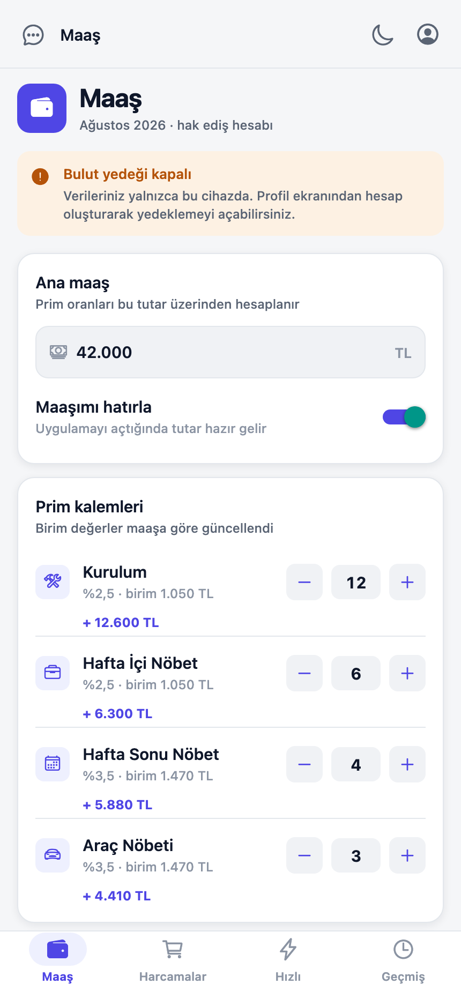
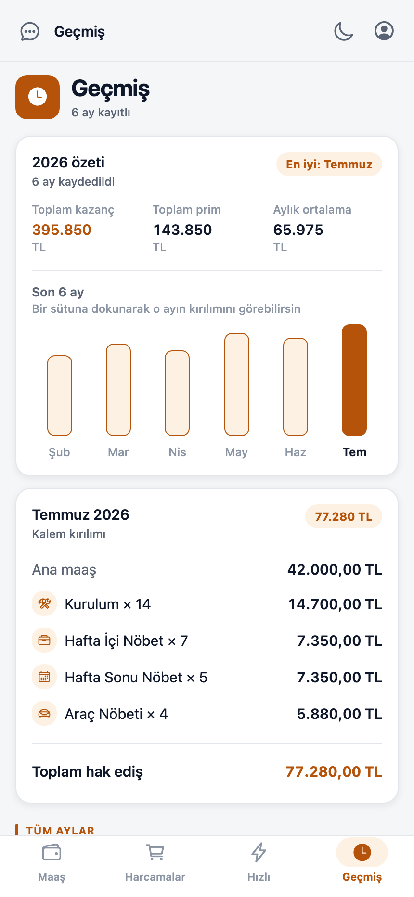
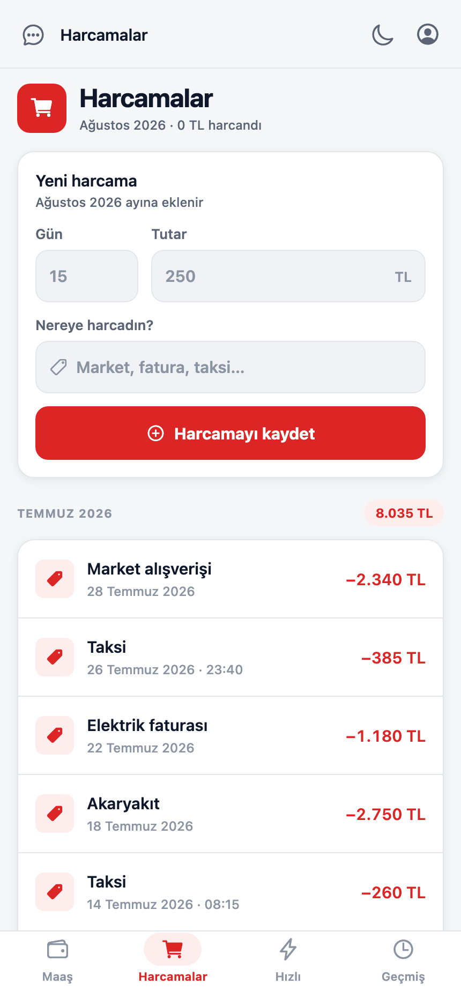
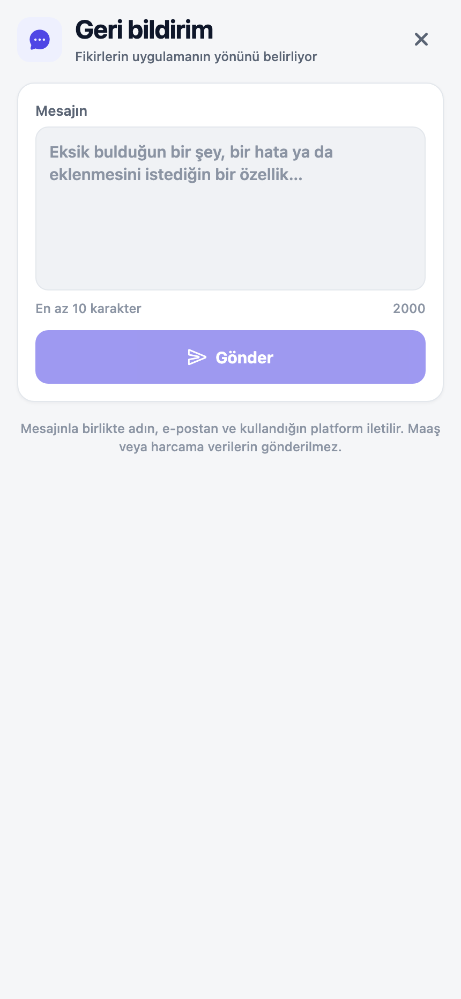
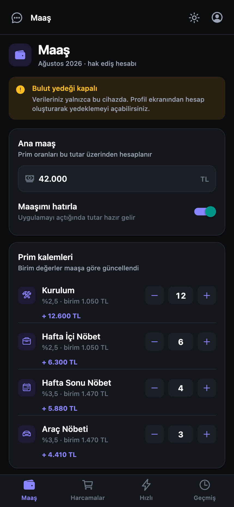
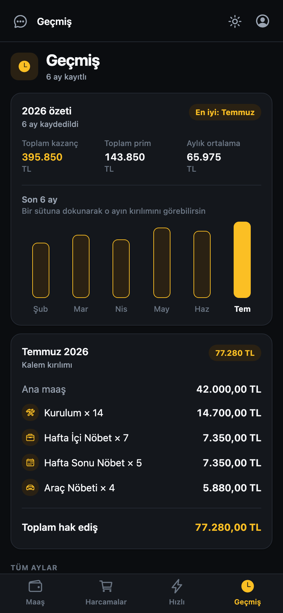
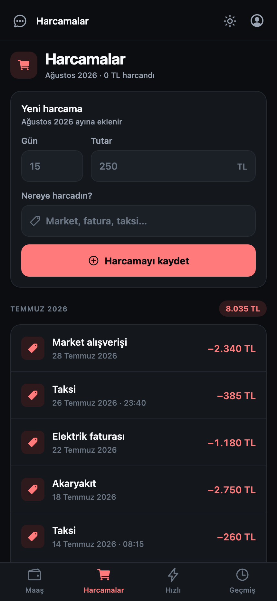
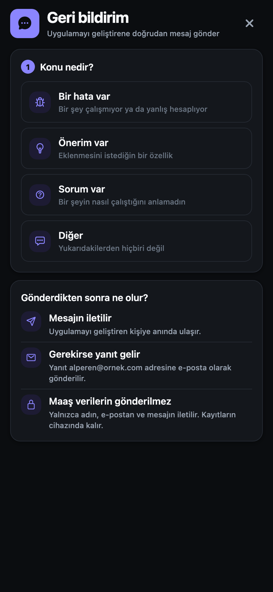

# Prim Hesaplama

Saha teknisyenleri için maaş, prim ve harcama takibi. Ana maaşın üzerine kurulum
ve nöbet primlerini hesaplar, ayları arşivler, harcamaları gruplar ve verileri
kullanıcının kendi hesabına yedekler.

**Expo SDK 57 · React Native 0.86 · React 19 · Firebase 12 · iOS / Android / Web**

<p align="center">
  
  
  
  
</p>
<p align="center">
  
  
  
  
</p>
<p align="center"><sub>Üstte açık, altta koyu tema. Tüm görüntüler <code>docs/demo/capture.mjs</code> ile gerçek derlemeden otomatik üretildi.</sub></p>

---

## İçindekiler

- [Özellikler](#özellikler)
- [Prim hesabı](#prim-hesabı)
- [Kurulum](#kurulum)
- [Komutlar](#komutlar)
- [Proje yapısı](#proje-yapısı)
- [Veri modeli ve güvenlik](#veri-modeli-ve-güvenlik)
- [Yönetim paneli](#yönetim-paneli)
- [Dağıtım](#dağıtım)
- [Ekran görüntülerini yenileme](#ekran-görüntülerini-yenileme)
- [Doğrulama durumu](#doğrulama-durumu)
- [Proje kasası (Obsidian)](#proje-kasası-obsidian)

---

## Doğrulama durumu

Bu depodaki **tüm ekran görüntüleri gerçek çıktılardır** — tasarım maketi değil.
`docs/demo/capture.mjs`, web sürümünü derleyip başsız Chrome'da açar, beklenen
içerik DOM'a gelene kadar bekler, arayüzle etkileşime girer ve kareyi alır;
aynı çalıştırmada konsol istisnalarını da toplar.

| Kontrol | Durum |
|---|---|
| TypeScript (`npm run typecheck`) | hatasız |
| ESLint (`npm run lint`) | hatasız |
| Web derlemesi (`npm run build:web`) | başarılı |
| Tarayıcıda açılan ekran | 12 / 12, konsol hatası yok |

**Henüz yapılmadı:** gerçek iOS/Android cihazda çalıştırma, Firestore
kurallarının canlı ortamda denenmesi ve bulut yedeğinin iki cihaz arasında
uçtan uca test edilmesi. Kurallar dağıtıldıktan sonra bir cihazda hesap açıp
ikincisinde giriş yaparak doğrulanmalıdır.

---

## Özellikler

| Sekme | Ne yapar |
|---|---|
| **Maaş** | Ana maaş + dört prim kalemini girer, toplamı canlı hesaplar, ayı arşive kaydeder. Aynı ay için ikinci kayıt engellenir; mevcut kayıt düzenlenebilir. |
| **Harcamalar** | Gün, açıklama ve tutar alır. Kayıtlar aya göre gruplanır, her ayın toplamı başlıkta durur. Açıklamada "taksi/uber/servis" geçerse saat de sorulur. |
| **Hızlı** | Hiçbir şey kaydetmeyen senaryo hesaplayıcı. Hazır "sakin / ortalama / yoğun ay" şablonlarıyla tek dokunuşta karşılaştırma. |
| **Geçmiş** | Yıllık toplam, toplam prim ve aylık ortalama; son 6 ayın sütun grafiği; seçilen ayın kalem kırılımı. |

Bunların yanında:

- **Yerel-öncelikli çalışma.** Tüm veri önce cihazda saklanır; uygulama çevrimdışı
  tam işlevlidir. Ağ yavaşsa açılış beklemez.
- **İsteğe bağlı bulut yedeği.** E-posta + şifreyle hesap açıldığında kayıtlar
  kullanıcının kendi UID'si altına yedeklenir; yeni cihazda giriş yapıldığında
  yerel ve buluttaki veri kimliğe göre birleştirilir, hiçbir kayıt kaybolmaz.
- **Açık / koyu tema.** İki mod için ayrı ayrı seçilmiş renk adımları; sistem
  tercihini izler, kullanıcı elle de değiştirebilir.
- **Erişilebilirlik.** Tüm dokunulabilir öğelerde rol ve etiket, dokunsal geri
  bildirim, `prefers-reduced-motion` uyumlu animasyonlar.

## Prim hesabı

İş kuralının tek kaynağı [`lib/prim.js`](lib/prim.js):

```js
birim(kalem) = anaMaas × ORAN[kalem]
tutar(kalem) = birim(kalem) × adet(kalem)
toplam       = anaMaas + Σ tutar(kalem)
```

| Kalem | Oran |
|---|---|
| Kurulum | %2,5 |
| Hafta içi nöbet | %2,5 |
| Hafta sonu nöbet | %3,5 |
| Araç nöbeti | %3,5 |

Oranı değiştirmek için yalnızca `PRIM_ORANLARI` güncellenir; "Maaş" ve "Hızlı"
ekranları da, geçmiş kayıtların kırılımı da aynı fonksiyondan beslenir.

## Kurulum

```bash
git clone https://github.com/Alperenoner/Maas-Prim-Hesaplama.git
cd Maas-Prim-Hesaplama
npm install

cp .env.example .env                                   # mobil uygulama
cp admin-panel/config.example.js admin-panel/config.js # yönetim paneli
# her iki dosyayı da kendi Firebase değerlerinizle doldurun

npx expo start
```

> Depoda `.env` ve `admin-panel/config.js` **bulunmaz**. Uygulamayı çalıştırmak
> için kendi Firebase projenizi oluşturup bu iki dosyayı doldurmanız gerekir.

`.env` içindeki değerler Firebase Console → *Proje ayarları → Uygulamalarınız*
bölümünden alınır. Bunlar gizli anahtar değildir (istemci yapılandırması tasarımı
gereği herkese açıktır); ayrı dosyada tutulmalarının nedeni geliştirme ve üretim
ortamları arasında kod değişikliği olmadan geçebilmektir. Verinin korunması
[`firestore.rules`](firestore.rules) ile sağlanır.

Üçüncü taraf e-posta servisi gerekmez — yanıtlar yöneticinin kendi e-posta
uygulamasından gönderilir.

**Firebase tarafında gerekenler:**

1. **Authentication** → *Sign-in method*: **Anonymous** ve **Email/Password**
   sağlayıcılarını etkinleştirin.
2. **Firestore** → veritabanı oluşturun, ardından kuralları dağıtın:
   `npm run deploy:rules`
3. `firestore.rules` içindeki yönetici e-postasını kendi adresinizle değiştirin.

## Komutlar

| Komut | Açıklama |
|---|---|
| `npm start` | Expo geliştirme sunucusu |
| `npm run ios` / `npm run android` | Yerel derleme ile çalıştır |
| `npm run web` | Tarayıcıda çalıştır |
| `npm run build:web` | `dist/` altına web sürümünü dışa aktar |
| `npm run lint` | ESLint |
| `npm run typecheck` | TypeScript kontrolü |
| `npm run deploy:rules` | Firestore güvenlik kurallarını yayınla |
| `npm run deploy:admin` | Yönetim panelini Firebase Hosting'e yayınla |

## Proje yapısı

```
app/                    expo-router rotaları (dosya = ekran)
  (tabs)/               dört ana sekme
  kayit · profil · feedback
components/ui/          tasarım sistemi bileşenleri
theme/                  renk, boşluk, tipografi jetonları + ThemeProvider
lib/                    saf iş mantığı — prim hesabı, biçimleme, depolama
services/               Firebase: auth, yedekleme, kullanıcı, geri bildirim
admin-panel/            web yönetim paneli (tek dosya, derleme adımı yok)
docs/                   teknik doküman + ekran görüntüsü üretici
firestore.rules         tek yetkilendirme noktası
```

Ayrım net: `lib/` Firebase'i tanımaz ve saf fonksiyonlardan oluşur, `services/`
ağ katmanıdır, `app/` yalnızca bu ikisini birleştirir. Ekranlar ham renk kodu
kullanmaz — hepsi `useTheme()` üzerinden jetonlardan okur.

## Veri modeli ve güvenlik

**Cihazda (AsyncStorage):** `maasKayitlari`, `harcamaKayitlari`,
`kullaniciProfili`, `temaTercihi`, `hatirlananMaas`, `maasiHatirla`.

**Firestore:**

| Koleksiyon | Kimlik | Erişim |
|---|---|---|
| `yedekler/{uid}` | oturum UID'si | yalnızca sahibi okur ve yazar |
| `kullanicilar/{uid}` | oturum UID'si | sahibi yazar; yönetici okur ve silme bayrağını yönetir |
| `geribildirimler/{autoId}` | otomatik | herkes kendi adına oluşturur; yalnızca yönetici okur ve yanıtlar |

Tanımlı olmayan her yol varsayılan olarak kapalıdır.

Kimlik modeli iki katmanlıdır: uygulama açılışta **anonim** oturum açar ve bu
modda tamamen yereldir — bulut yedeği kapalıdır. Kullanıcı bir şifre
belirlediğinde anonim hesap `linkWithCredential` ile kalıcı hesaba yükseltilir;
UID değişmediği için o ana kadar biriken veri korunur.

> **Not:** Yedek belgesi kullanıcının UID'siyle anahtarlanır. Daha önce e-posta
> kullanılıyordu ve kural yalnızca "oturum açmış olmak" arıyordu; bu, bir
> başkasının e-postasını bilen herkesin o kişinin maaş ve harcama geçmişini
> okumasına izin veriyordu. Bu depoyu klonlayıp eski bir kural setiyle
> çalıştırmayın — `npm run deploy:rules` ile güncel kuralları yayınlayın.

## Yönetim paneli

`admin-panel/index.html` — derleme adımı olmayan tek dosya. Firebase SDK'sı CDN'den
ES modülü olarak yüklenir. Geri bildirimleri canlı dinler, yanıtlar (EmailJS ile
e-posta gönderir), yumuşak siler ve geri yükler; kayıtlı kullanıcıları listeler.

Yetki tamamen Firestore kurallarındadır: panel herkese açık bir URL'de dursa da
yönetici e-postası dışında bir hesapla giriş yapan hiçbir veri göremez.

**Yanıtlama akışı:** Yanıt yazılıp *"E-posta taslağı hazırla"* denildiğinde
`mailto:` ile kendi e-posta uygulamanız hazır taslakla açılır; gönderimi siz
yaparsınız. Panel gönderimi doğrulayamayacağı için kaydı "Yanıtlandı" olarak
işaretlemeden önce onayınızı ister.

> Daha önce bu iş EmailJS ile otomatikti. İstemci tarafında çalışan e-posta
> servislerinin anahtarları yayınlanan sayfanın kaynağından okunabiliyor ve
> bunları korumanın tek yolu olan alan adı kısıtlaması ücretli planlara ait.
> `mailto:` ile sayfada hiçbir anahtar durmuyor, aylık kota sınırı yok ve yanıt
> yöneticinin kendi adresinden gittiği için kullanıcı doğrudan geri yazabiliyor.

## Dağıtım

```bash
npm run deploy:rules      # Firestore kuralları  (önce bu)
npm run deploy:admin      # Yönetim paneli
eas build --platform all  # Mobil derlemeler
eas update                # OTA güncelleme
```

`deploy:*` komutları `firebase-tools` gerektirir: `npx firebase-tools login`.

## Ekran görüntülerini yenileme

`docs/demo/capture.mjs`, web sürümünü derler, yerel bir sunucuda yayınlar ve
Chrome'u DevTools protokolü üzerinden sürerek her ekranı iki temada da yakalar.
Demo verisi `docs/demo/seed.html` içinde tanımlıdır.

```bash
node docs/demo/capture.mjs                # derler ve yakalar
node docs/demo/capture.mjs --skip-build   # mevcut dist/ ile yakalar
```

Teknik dokümanın tamamı için: `docs/index.html`
(`python3 -m http.server 8080 --directory docs` ile açılabilir).

## Proje kasası (Obsidian)

`MaasProjesi/` klasörü bir **Obsidian kasasıdır** — projenin tüm mimarisi,
kararları ve yaşanmış sorunları birbirine bağlı notlar hâlinde burada.

```
MaasProjesi/
├── 00 Başlangıç.md          giriş noktası (MOC)
├── Genel Bakış/             proje, teknoloji yığını, sürüm geçmişi
├── Mimari/                  katmanlar, yönlendirme, durum, veri akışı
├── Ekranlar/                yedi ekranın ayrıntısı
├── Tasarım Sistemi/         renk, tipografi, bileşenler
├── İş Mantığı/              prim kuralı, veri modeli, göç
├── Güvenlik/                kurallar, kimlik, kapatılan açıklar
├── Altyapı/                 Firebase, dağıtım, panel
├── Kararlar/                7 mimari karar kaydı (ADR)
├── Sorun Giderme/           gerçekten yaşanmış sorunlar
└── ekler/                   13 ekran görüntüsü
```

**43 not**, sıfır kırık bağlantı. Mermaid diyagramları ve gömülü görsellerle.

Obsidian ile açmak için: *Open folder as vault* → `MaasProjesi/` klasörünü seç.
Obsidian olmadan da okunabilir — hepsi düz Markdown.

Öne çıkan notlar:

| Not | İçerik |
|---|---|
| `Kararlar/` | Neden `expo-crypto` kaldırıldı, neden EmailJS yerine `mailto`, React Compiler tuzağı |
| `Güvenlik/Kapatılan Açıklar` | 7 açığın tamamı, etkileri ve çözümleri |
| `Sorun Giderme/` | OTA neden gelmez, Metro önbelleği tuzağı, Android gölgeleri |
